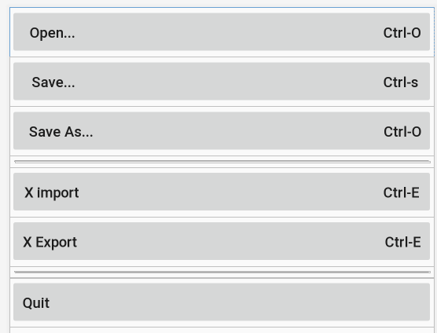

# Android布局实验

## 线性布局实现

### 首先定义线性布局为垂直布局

```xml
<LinearLayout
android:orientation="vertical"     
```

在每一个线性布局中定义水平布局

```xml
<LinearLayout
android:orientation="horizontal"
```

### 将buttom大小定义成wrap，权重定义为1，大小15dp，取消全大写，如下

```xml
<Button    android:layout_width="wrap_content"    android:layout_height="wrap_content"    android:layout_weight="1"    android:text="One,One"    android:textSize="15dp"    android:textAllCaps="false"/>
```

### 效果图如下


## ConstraintLayout布局实现

### 这个布局我一般就用两个约束，一个X轴一个Y轴，再把颜色和大小调好就OK了

```xml
<Button    android:id="@+id/button3"    android:layout_width="413dp"    android:layout_height="57dp"    android:layout_marginTop="45dp"    android:background="#FF689A"    android:text="violet"    app:layout_constraintStart_toStartOf="parent"    app:layout_constraintTop_toBottomOf="@+id/button4" />
```

### 效果图如下


## 表格布局实现

### 大小采用wrap，再取消大小写

```xml
<Button
android:layout_width="wrap_content"
android:layout_height="wrap_content"android:text="  Open...                                                                                       Ctrl-O"   android:textAllCaps="false"/>
```

### 用view来画线，给他1dp的粗细

```xml
<View android:layout_width="fill_parent" 
      android:layout_marginTop="5dp"    
      android:layout_marginBottom="5dp"    
      android:layout_height="1dp"    
      android:layout_marginLeft="5dp"    
      android:layout_marginRight="5dp"    
      android:background="#aa000000" />
```

### 效果图如下



